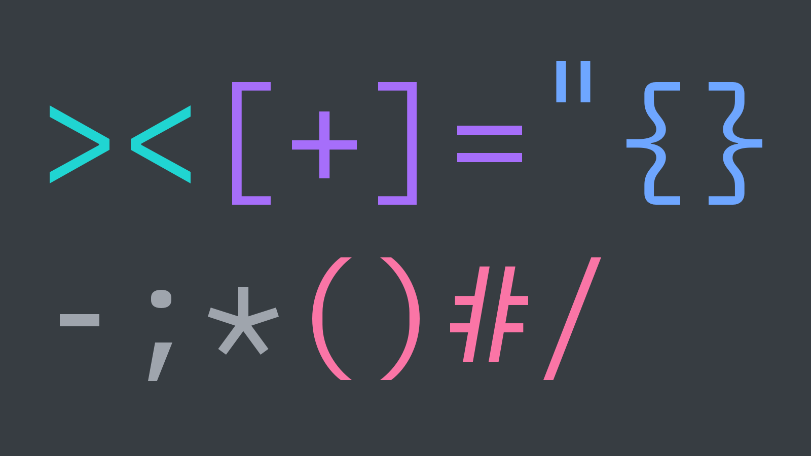
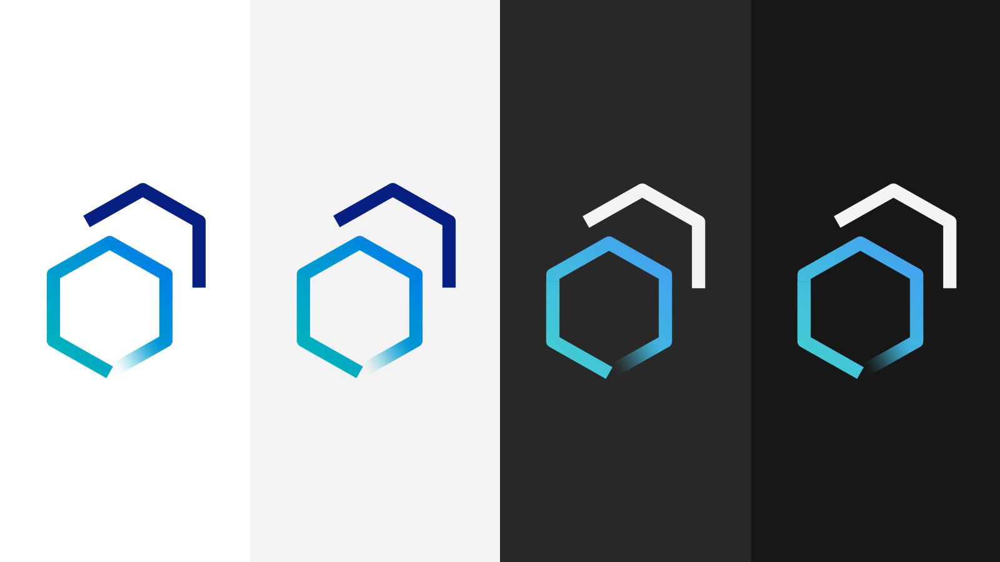
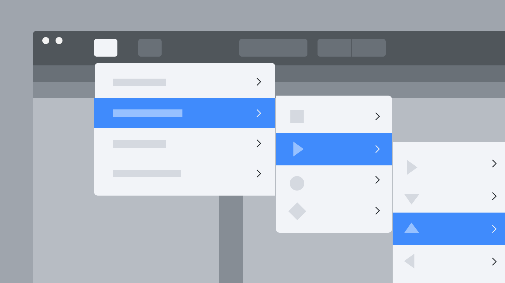
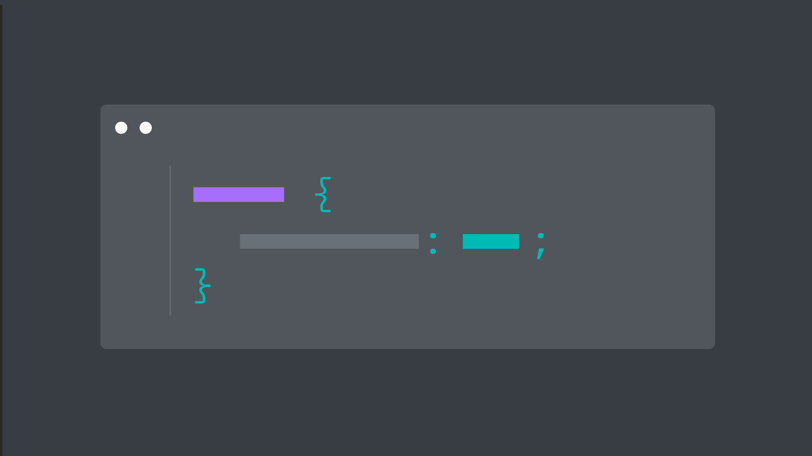
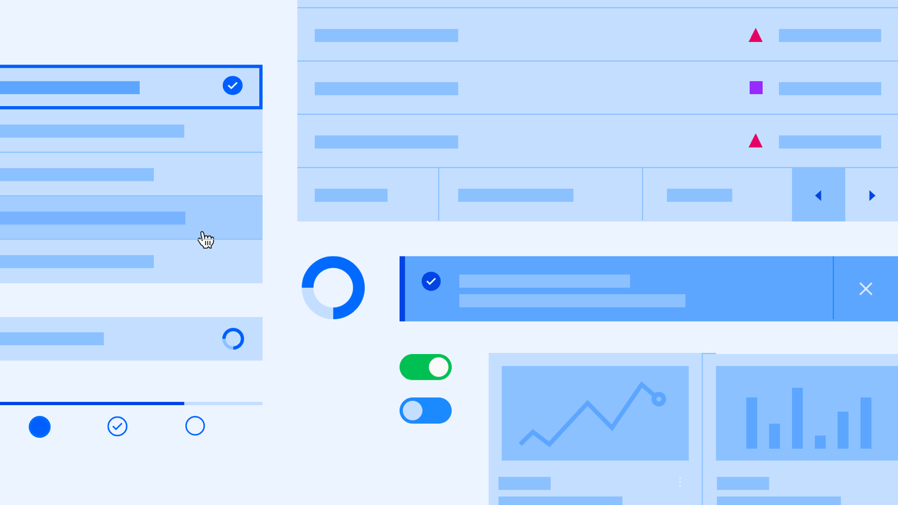
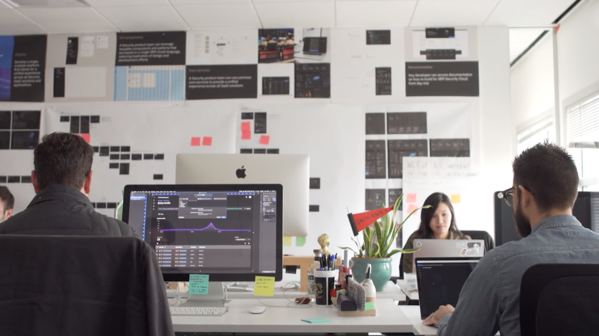

<PageDescription>

Everything you need to work with, learn about, and contribute to Carbon.

</PageDescription>

<AnchorLinks>
  <AnchorLink>Development resources</AnchorLink>
  <AnchorLink>Design resources</AnchorLink>
  <AnchorLink>Tools</AnchorLink>
  <AnchorLink>Reading</AnchorLink>
</AnchorLinks>

## Development resources

### GitHub repos

<Row className="resource-card-group">
<Column colMd={4} colLg={4} noGutterSm>
    <ResourceCard
      title="Carbon Components"
      aspectRatio="2:1"
      actionIcon="arrowRight"
      href="https://github.com/ibm/carbon-components"
      >

  </ResourceCard>
</Column>
<Column colMd={4} colLg={4} noGutterSm>
    <ResourceCard
      title="Carbon Components React"
      aspectRatio="2:1"
      actionIcon="arrowRight"
      href="https://github.com/ibm/carbon-components-react"
      >

  </ResourceCard>
</Column>
<Column colMd={4} colLg={4} noGutterSm>
    <ResourceCard
      title="Carbon Components Angular"
      aspectRatio="2:1"
      actionIcon="arrowRight"
      href="https://github.com/ibm/carbon-components-angular"
      >

  </ResourceCard>
</Column>
<Column colMd={4} colLg={4} noGutterSm>
    <ResourceCard
      title="Carbon Components Vue"
      aspectRatio="2:1"
      actionIcon="arrowRight"
      href="https://github.com/ibm/carbon-vue"
      >

  </ResourceCard>
</Column>
<Column colMd={4} colLg={4} noGutterSm>
    <ResourceCard
      title="Carbon boilerplate"
      aspectRatio="2:1"
      actionIcon="arrowRight"
      href="https://github.com/carbon-design-system/carbon-boilerplate"
      >

  </ResourceCard>
</Column>
</Row>

### Storybooks

<Row className="resource-card-group">
<Column colMd={4} colLg={4} noGutterSm>
    <ResourceCard
      title="Carbon React Storybook"
      aspectRatio="2:1"
      actionIcon="arrowRight"
      href="http://react.carbondesignsystem.com/"
      >

  </ResourceCard>
</Column>
<Column colMd={4} colLg={4} noGutterSm>
    <ResourceCard
      title="Carbon Components Vue Storybook"
      aspectRatio="2:1"
      actionIcon="arrowRight"
      href="http://vue.carbondesignsystem.com/"
      >

  </ResourceCard>
</Column>
</Row>

## Design resources

### Theme libraries

<Row className="resource-card-group">
<Column colMd={4} colLg={4} noGutterSm>
    <ResourceCard
      title="White theme"
      aspectRatio="2:1"
      actionIcon="download"
      href="sketch://add-library/cloud/JaVzz"
      >

  </ResourceCard>
</Column>
<Column colMd={4} colLg={4} noGutterSm>
    <ResourceCard
      title="Gray 10 theme"
      aspectRatio="2:1"
      actionIcon="download"
      href="sketch://add-library/cloud/Onwv2"
      >

  </ResourceCard>
</Column>
<Column colMd={4} colLg={4} noGutterSm>
    <ResourceCard
      title="Gray 90 theme"
      aspectRatio="2:1"
      actionIcon="download"
      href="sketch://add-library/cloud/eo37p"
      >

  </ResourceCard>
</Column>
<Column colMd={4} colLg={4} noGutterSm>
    <ResourceCard
      title="Gray 100 theme"
      aspectRatio="2:1"
      actionIcon="download"
      href="sketch://add-library/cloud/d13Ll"
      >

  </ResourceCard>
</Column>
</Row>

### Color, grid, and icons

<Row className="resource-card-group">
<Column colMd={4} colLg={4} noGutterSm>
    <ResourceCard
      title="RGB color palettes (.ase and .clr)"
      aspectRatio="2:1"
      actionIcon="download"
      href="https://www.carbondesignsystem.com/files/IBM_Colors_RGB.zip"
      >

  </ResourceCard>
</Column>
<Column colMd={4} colLg={4} noGutterSm>
    <ResourceCard
      title="IBM Design Language library"
      aspectRatio="2:1"
      actionIcon="download"
      href="sketch://add-library/cloud/75VZZ"
      >

  </ResourceCard>
</Column>
<Column colMd={4} colLg={4} noGutterSm>
    <ResourceCard
      title="2x Grid template"
      aspectRatio="2:1"
      actionIcon="download"
      href="sketch://add-library/cloud/ngV7z"
      >

  </ResourceCard>
</Column>
</Row>

### Design kit

<Row className="resource-card-group">
<Column colMd={4} colLg={4} noGutterSm>
    <ResourceCard
      title="Carbon Design Kit"
      aspectRatio="2:1"
      actionIcon="arrowRight"
      href="https://github.com/ibm/carbon-design-kit"
      >

  </ResourceCard>
</Column>
</Row>

 

#### IBM Plex

Carbon uses the open-source typeface [IBM Plex](https://github.com/IBM/plex) – carefully designed to meet IBM's needs as a global technology company and reflect IBM's spirit, beliefs, and design principles.

#### IBM Design Language

Carbon delivers the [IBM Design Language](https://www.ibm.com/design/language/) as tools for designers and developers, guidance, tutorials, and support.

## Tools

<Row className="resource-card-group">
<Column colMd={4} colLg={4} noGutterSm>
    <ResourceCard
      title="Carbon CodePen"
      aspectRatio="2:1"
      actionIcon="arrowRight"
      href="http://www.codepen.io/team/carbon"
      >

  </ResourceCard>
</Column>
<Column colMd={4} colLg={4} noGutterSm>
    <ResourceCard
      title="Theming sandbox"
      aspectRatio="2:1"
      actionIcon="arrowRight"
      href="http://themes.carbondesignsystem.com/"
      >

  </ResourceCard>
</Column>
<Column colMd={4} colLg={4} noGutterSm>
    <ResourceCard
      title="Color contrast checker"
      aspectRatio="2:1"
      actionIcon="download"
      href="https://marijohannessen.github.io/color-contrast-checker/"
      >

  </ResourceCard>
</Column>
</Row>

## Reading

### Featured stories

<Row>
<Column colMd={4} colLg={4} noGutterMdLeft>
    <ArticleCard
      title="Smashing Magazine's “Design Systems” Book"
      href="https://www.smashingmagazine.com/design-systems-book/"
      >

  </ArticleCard>
</Column>
<Column colMd={4} colLg={4} noGutterMdLeft>
    <ArticleCard
      title="Winter 2017 HOW In-House Design Award Winner"
      href="http://www.howdesign.com/84-award-winning-projects-from-in-house-design-teams/"
      >

  </ArticleCard>
</Column>
<Column colMd={4} colLg={4} noGutterMdLeft>
    <ArticleCard
      title="Path to Design System Maturity"
      href="https://medium.com/ux-power-tools/the-path-to-design-system-maturity-d403daba692a"
      >

  </ArticleCard>
</Column>
<Column colMd={4} colLg={4} noGutterMdLeft>
    <ArticleCard
      title="Responsive Web Design Podcast"
      href="https://responsivewebdesign.com/podcast/ibm-carbon/"
      >

  </ArticleCard>
</Column>
<Column colMd={4} colLg={4} noGutterMdLeft>
    <ArticleCard
      title="UX Pin Virtual Design Summit"
      href="https://www.youtube.com/watch?v=eSvq5MieOdw&t=144s"
      >

  </ArticleCard>
</Column>
</Row>

### Articles

<Row>
<Column colMd={4} colLg={4} noGutterMdLeft>
    <ArticleCard
      title="Carbon v10.3.0 (May 2019)"
      author="Josh Black"
      date="June 6, 2019"
      readTime="Read time: 5 min"
      href="https://medium.com/carbondesign/carbon-v10-3-0-may-2019-41b1f970f0ce"
      >

  </ArticleCard>
</Column>
<Column colMd={4} colLg={4} noGutterMdLeft>
    <ArticleCard
      title="Essentials: Learn to build with Carbon"
      author="Matt Rosno"
      date="May 15, 2019"
      readTime="Read time: 2 min"
      href="https://medium.com/carbondesign/essentials-learn-to-build-with-carbon-1d11ce05125f"
      >

  </ArticleCard>
</Column>
<Column colMd={4} colLg={4} noGutterMdLeft>
    <ArticleCard
      title="Carbon is moving to a monorepo"
      author="Josh Black"
      date="May 10, 2019"
      readTime="Read time: 3 min"
      href="https://medium.com/carbondesign/carbon-is-moving-to-a-monorepo-c6bfcbe87de0"
      >

  </ArticleCard>
</Column>
<Column colMd={4} colLg={4} noGutterMdLeft>
    <ArticleCard
      title="Carbon dark themes are here"
      author="Lauren Rice"
      date="April 29, 2019"
      readTime="Read time: 3 min"
      href="https://medium.com/carbondesign/carbon-dark-themes-are-here-a18910a0f910"
      >

  </ArticleCard>
</Column>
<Column colMd={4} colLg={4} noGutterMdLeft>
    <ArticleCard
      title="Carbon v10 Release"
      author="Robin Cannon"
      date="April 4, 2019"
      readTime="Read time: 3 min"
      href="https://medium.com/carbondesign/carbon-v10-release-812eacb7da7f"
      >

  </ArticleCard>
</Column>
<Column colMd={4} colLg={4} noGutterMdLeft>
    <ArticleCard
      title="Design with Carbon: Update your Sketch symbols to V10"
      author="Anna Gonzales"
      date="April 2, 2019"
      readTime="Read time: 2 min"
      href="https://medium.com/carbondesign/design-with-carbon-update-your-sketch-symbols-to-v10-ef3132ea2e97"
      >

  </ArticleCard>
</Column>
<Column colMd={4} colLg={4} noGutterMdLeft>
    <ArticleCard
      title="Minimal CSS with Carbon"
      author="Josh Black"
      date="April 1, 2019"
      readTime="Read time: 6 min"
      href="https://medium.com/carbondesign/minimal-css-with-carbon-b0c089ccfa71"
      >

  </ArticleCard>
</Column>
<Column colMd={4} colLg={4} noGutterMdLeft>
    <ArticleCard
      title="Preview Carbon v10 today"
      author="Josh Black"
      date="March 22"
      readTime="Read time: 4 min"
      href="https://medium.com/carbondesign/preview-carbon-v10-today-df42b8bd0130"
      >

  </ArticleCard>
</Column>
<Column colMd={4} colLg={4} noGutterMdLeft>
    <ArticleCard
      title="What to expect in Carbon 10"
      author="Robin Cannon"
      date="December 10, 2018"
      readTime="Read time: 5 min"
      href="https://medium.com/carbondesign/what-to-expect-in-carbon-10-5af1bd6e25f6"
      >

  </ArticleCard>
</Column>
<Column colMd={4} colLg={4} noGutterMdLeft>
    <ArticleCard
      title="Up & Running with Carbon React"
      author="Josh Black"
      date="October 19, 2018"
      readTime="Read time: 4 min"
      href="https://medium.com/carbondesign/up-running-with-carbon-react-in-less-than-5-minutes-25d43cca059e"
      >

  </ArticleCard>
</Column>
<Column colMd={4} colLg={4} noGutterMdLeft>
    <ArticleCard
      title="Hacktoberfest with Carbon"
      author="Josh Black"
      date="October 16, 2018"
      readTime="Read time: 3 min"
      href="https://medium.com/carbondesign/hacktoberfest-with-carbon-95c48943f586"
      >

  </ArticleCard>
</Column>
<Column colMd={4} colLg={4} noGutterMdLeft>
    <ArticleCard
      title="Data Table updates in Carbon React v5.22.0"
      author="Josh Black"
      date="February 20, 2018"
      readTime="Read time: 5 min"
      href="https://medium.com/carbondesign/data-table-updates-in-carbon-react-v5-22-0-6da0c24a96d6"
      >

  </ArticleCard>
</Column>
<Column colMd={4} colLg={4} noGutterMdLeft>
    <ArticleCard
      title="Introducing Carbon Themes"
      author="Bethany Sonefeld"
      date="August 11, 2017"
      readTime="Read time: 3 min"
      href="https://medium.com/design-ibm/introducing-carbon-themes-83d3985a8627"
      >

  </ArticleCard>
</Column>
<Column colMd={4} colLg={4} noGutterMdLeft>
    <ArticleCard
      title="Carbon: Designing inside Big Blue"
      author="Bethany Sonefeld"
      date="March 30, 2017"
      readTime="Read time: 5 min"
      href="https://medium.com/design-ibm/carbon-designing-inside-big-blue-8577883cfe42"
      >

  </ArticleCard>
</Column>
</Row>